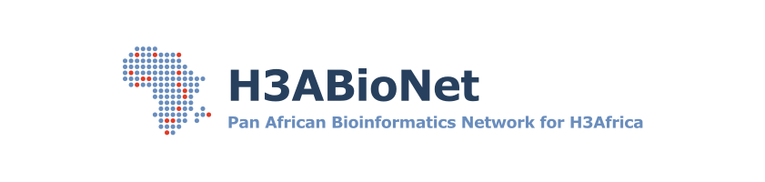

  

This website hosts the Standard Operating Procedures (SOPs) for common data analysis tasks within the [H3ABioNet](https://h3abionet.org/) consortium, which are:

* [Human Variant calling](./Variant-Calling-1-0)
* [Genome Wide Association Studies](./GWAS)
* [Gene expression analysis using RNA-Seq](./RNA-Seq-1-0)
* [16s microbiome analysis](./16s-rRNA-1-0)

These SOPs were meant to help various H3ABioNet nodes in their accreditation exercises [^1].

You can use the buttons at the top of the page to navigate those various SOPs, or the side panel to access the subsections within each.

Feedback is also welcome! Please feel free to [fork this repo](https://github.com/h3abionet/H3ABionet-SOPs), open an issue or a pull request. Additionally, check out our [contribution guide](https://h3abionet.github.io/H3ABionet-SOPs/cont_tech-guide-1).

### Funding
The development of the H3ABioNet SOPs is supported by the H3Africa program grant U24HG006941 from the National Human Genome Research Institute (NHGRI) of the National Institutes of Health (NIH) entitled “H3ABioNet: Informatics Solutions for H3Africa”. The content is solely the responsibility of the authors and does not necessarily represent the official views of the National Institutes of Health.

### References
[^1]: Jongeneel, C. Victor, et al. ["Assessing computational genomics skills: Our experience in the H3ABioNet African bioinformatics network."](https://doi.org/10.1371/journal.pcbi.1005419) PLoS computational biology 13.6 (2017): e1005419

[//]: <> (These are common abbreviations in the page.)
*[SOPs]: Standard Operating Procedures
*[H3Africa]: Human Heredity and Health in Afrcia Consortium
*[H3ABioNet]: The Bioinformatics Network within the H3Africa Consortium
